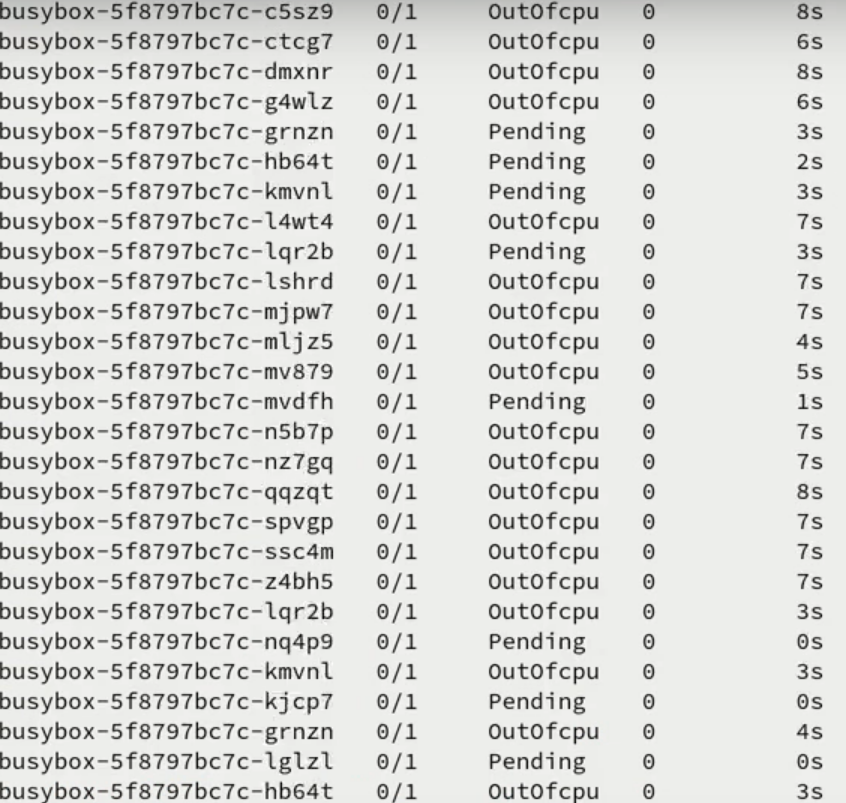
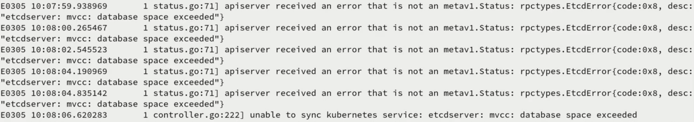

# PoC for https://github.com/kubernetes/kubernetes/issues/89007
Examples of kubernetes resources to cause dos of the control plane and eventually "space exceeded" error in etcd.
`protection` directory contains kubernetes resources which can prevent the dos from happening.

In `busybox-dos.yaml` replace the nodeName with the one from your cluster and adjust the number of CPUs to the value higher
than the target node has.

For `minikube` use yaml with `minikube` in the name, it should work out of the box and consequences should be 
visible right away.
 
`busybox-dos-sysctl.yaml` shows another way of triggering the bug, if the kubelets in your cluster do not support `sysctls`.

## Results

You can watch this bug in action here: https://drive.google.com/file/d/1CKEgIvNfSZsD2FdodVW9VsIQ7Dq-Q0wG/view?usp=sharing

dos: 

etcd:
